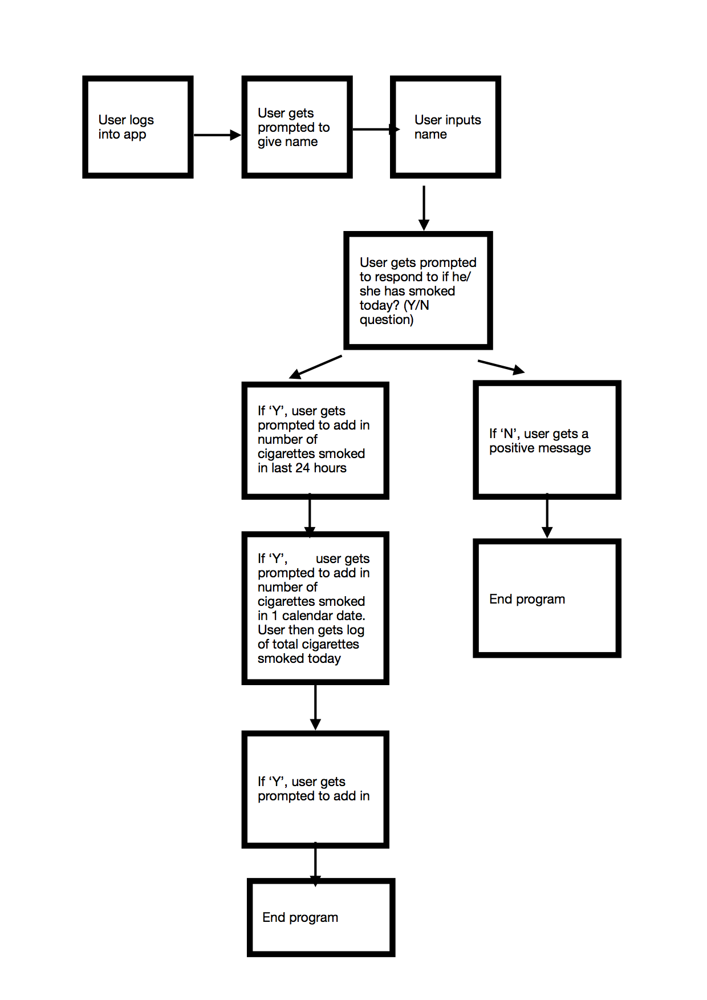
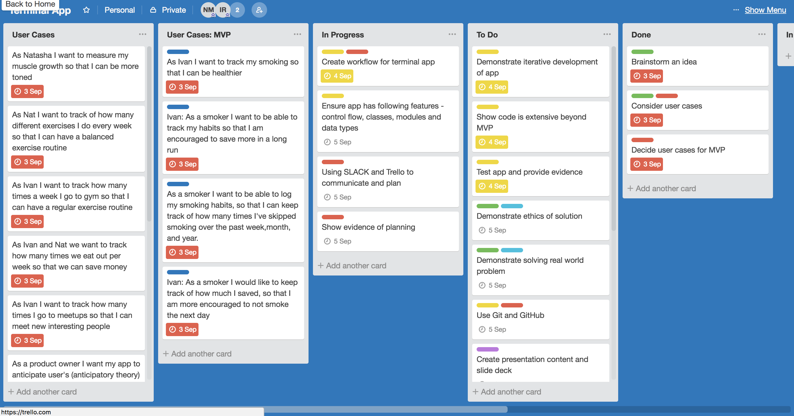

# Breathe App
________________

**GitHub Repo Links**
1. Ivan https://github.com/IvanRahn/Breathe
2. Natasha https://github.com/natashamunasinghe/Breathe

## CRITERIA 1: Description of the app
________________

### 2.1 Purpose
The purpose of our app, Breathe, is to enable people to live healthy lives. 
We aim to achieve this purpose by enabling users to track both negative and positive lifestyle habits e.g smoking, meals and meal purchases, gym workout sessions

#### MVP
Due to very limited time restrictions for the whole project (3 days), we focused on enabling users to track and monitor 1 habit - their smoking habit. We also focused on tracking 4 actions only. 
These actions are;
1. Input user name
2. Input whether they have smoked or not in the last 24 hours
3. Input how many cigarettes they have smoked in the last 24 hours
4. View sum of total cigarettes smoked todate

#### 2.2 Functionality
**Our app can:** 
1. Input of name to personalise the experience
2. Track how many days a user has gone without smoking
3. Track user’s cigarette intake daily
4. Sum up how many cigarettes user has smoked over a period of time, from time since he/she started using the app
5. Deliver small, positive messages that rewards positive behaviour


Commenting on functionality and use of data types 
We used commenting on functionality of app and use of particular data types for terminal app
  
```ruby
#creating User class
class User
  attr_accessor :username, :log

  def initialize(username)
    #runs a name_check on the username
    @username = name_check(username)
    #we tried array first but decided to go with hash to be able to save dates
    @log = {}
  end

  #Method to check for valid input for the username
  def name_check(name)
    if name.nil? or name.empty? or name =~ /\W+/ or name == "0"
      puts "Everyone must have a valid name."
      #raise an error in case of invalid input
      raise ArgumentError.new("Error - invalid name")
    end
    #capitalize the first letter of the name
    name.capitalize!
  end

  def sum
    puts "You have smoked #{log.values.inject { |a, b| a.to_i + b.to_i }} cigarettes to date! Shame on you!"
  end
end
```


**Data Types Used:** We used the following data types 
1. Boolean
2. Array
3. Hash
4. String
5. Integers


**Code extensions**
Apart from our MVP, other potential code extensions could include;
1. Asking users to identify their daily mood
2. Asking users to identify if they had any cravings (associated with smoking) within last 24 hours
3. Tracking moods of users and matching that against  days they smoked/didn’t smoke
4. Tracking other habits like gym attendance, food consumption etc

Evidence of considering accessibility
We did consider mobile accessibility and how WCAG 2.0 and Other W3C/WAI guidelines apply.

**Factors that need to be considered are:**
1. Screen size
2. Zoom and magnification
3. Text spacing
4. Consistency of layout
5. Positioning of elements on page
More information can be found here on accessibility: https://www.w3.org/TR/mobile-accessibility-mapping/#introduction


**Challenges we encountered building this app**
1. Reading and writing into a file; we had to use a Ruby Gem ‘OJ’ to retrieve the file once we had saved the user information. This gem needed to be able parse JSON.
2. Creation Exceptions - We created 3 exceptions. They were as follows;
* Name: We needed the first letter capitalised and the following letters in lowercase. We needed at least 1 character. We also allowed alpha numerics because we cannot discrimInate against R2D2. This raises an argument error.
* Have you smoked question:  We only needed 2 input responses (Y and N). If given an invalid response, it prompts for the correct input again
* Number of cigarettes: We had to ensure that there were only numeric values.
* Test cases
We had challenges creating test cases but we managed to use RSPEC to create 3 unit tests using RSPEC. Ideally we would create these tests before we actually create any code. The unit tests were to check for
* Creates an user class
* It takes only a valid input for username
* Creates a FileOperations class


### Use of Control flow structures
  

```ruby
  puts "#{user.username}, have you smoked today? Y/N"
  #Control flow using switch statement to make it more dry and easier to scale
  case gets.chomp
  when "y"
    cig_amount(user)
  when "n"
    success(user)
  else
    #raise an error in case of incorrect input	
    raise ArgumentError.new("Only Y or N")
  end
```


### Use of Classes
  

```ruby

class FileOperations
  attr_accessor :username

  def initialize(username)
    @username = username
  end

  # Method to check if file exists, returns new instance of User class if it doesn't
  # and retrieves the data from the file if the user already exists
  def retrieve_data
    File.file?("#{@username}") ? customer = read_from_file : customer = User.new(username)
    customer
  end

  # Saves user object to file using Oj gem. We chose Oj over Nick's gists to skip the hashing process
  def save_to_file
    File.open("#{@username.username}", "w") { |file|
      file.write Oj::dump username
    }
  end

  # Reads from file
  def read_from_file
    Oj::load File.read("#{@username}")
  end
end
```


### Use of Methods
```ruby
def success(user)
  puts "Well done! Keep up the amazing work #{user.username}!"
  user.log[Date.today.iso8601] = 0
end
```
  


### Use of Recursion  
  
```ruby
def smoking(user)
  puts "#{user.username}, have you smoked today? Y/N"
  #Control flow using switch statement to make it more dry and easier to scale
  case gets.chomp
  when "y"
    cig_amount(user)
  when "n"
    success(user)
  else
    #raise an error in case of incorrect input 
    raise ArgumentError.new("Only Y or N")
  end
  #rescue from the error: recurse the function
rescue
  begin
    system "clear"
    puts "Something is wrong with your input, please try again"
    sleep(0.5)
    smoking(user)
  end
end
```

### 2.3 Instructions for use
New and returning users
1. User gets welcome message and then prompted to type in their name
2. Providing it’s not an edge case and valid input, user gets asked if he smoked today (Boolean Y/N question)
3. Providing user inputs ‘Y’ - he gets asked a question asking him how many cigarettes he has smoked in the last 24 hours? 
4. User inputs the number of cigarettes (cigarette data) smoked and this cigarette data is saved in an external text file
5. Providing user inputs ‘N’ - he gets a negative (slightly comical) message
6. Irrespective of whether he answered ‘Y’ or ‘N’ the user will see how many cigarettes he has or has not smoked (depending on how long he has been doing it)
________________

## CRITERIA 2: Details of design & planning process
________________

### CRITERIA 2.1 Evidence of app idea brainstorming sessions
The following is the brainstorming process we undertook to come up with an idea.
1. We individually looked at the Assignment task instructions as well as the Assessment Rubric
2. We identified 18 criteria in the Assessment Rubric and decided to base our brainstorming on meeting as much of this criteria as possible including criteria involving the idea solving a broader social problem
3. Brainstorming process: We then undertook a brainstorming process called the Crazy 8s brainstorming process that is used in UX and design thinking and ideation processes. Due to time limitations, we amended this to a Crazy 3s ideation process; where both team partners on our own take a few minutes to come up with 3 radical ideas that we think meets the Assessment Criteria (uninfluenced by each other and to give autonomy to each other’s thinking processes). Then we wrote down each of these ideas and 1 by 1 shared our ideas with each other. We explained the rationale of each idea and after a short discussion, decided on 1 idea to proceed with that we were both happy with. We both decided to proceed with the idea that was purposeful and were passionate about.
  


1. Getting approval of the idea: After we had decided on our idea, we did get approval from Bianca for the idea. Her advice was also to focus and narrow down on 1 problem (i.e smoking) to focus on for the app given the time restraints.
2. Broader Social Impact of the Problem: Our idea is about enabling people to have positive lifestyle habits including tobacco smoking, alcohol consumption, physical inactivity and so on. These factors and others have been known to account for 32.3% of the total burden and injury on Australian Society. Our MVP is about enabling users to track key metrics related to their smoking habits. One of the team members is a smoker and being able to change this habit is important to him.
* Social costs of the smoking: Tobacco was responsible for 15 551 deaths  and 20.1% of the disease burden related to cancer and cardiovascular disease. 
* Economic costs of the smoking: It results in approximately $318 million spent on related healthcare costs. Smokers could cost the Australian economy $388 billion over the course of the Australian population’s working lives when you take into account factors like second hand smoke.

________________

### 2.2 App User/Workflow diagram 
1.  Brainstorming User cases: We started our planning process by focusing on creating user cases. We created multiple user cases including the following;
* 1 user who would like to stop smoking (i.e. as Ivan I want to track my smoking so that I can be healthier)
* 1 user who is a fitness gym that would like to increase membership amongst health conscious people
* 1 person who would like to track their gym habits
1. Focusing on 1 user and 1 habit for MVP: We did get expertise from an external UX professional to help us decide on 1 user (as time is limited for this assignment) as well as doing our own user research - the user who wanted to track 1 smoking habit. That habit was to track how many cigarettes he smokes per day.
2. Smoking Epic user workflow: We created 7 simple steps that the user would take. See below for these 7 steps. For our MVP, we only focused on steps 1-3.
* Step 1: Smoker wants to quit. Decides habit tracking will help.
* Step 2: Smoker enjoys phone access but not pen and paper. Apps are the way to go.
* Step 3: Smoker downloads app and adds smoking habits himself



See attached for separate PDF document to view app workflow diagram     
                   
**Extra resources we referred to for user workflow.**
* Atlassian playbook - https://www.atlassian.com/team-playbook/plays/journey-mapping#
* IBM - https://www.ibm.com/cloud/garage/content/think/practice_scenario_mapping/practice_personas
* IDEO - https://www.ideou.com/blogs/inspiration/use-customer-journey-maps-to-uncover-innovation-opportunities
* Jeff Patton - story mapping - https://jpattonassociates.com/wp-content/uploads/2015/03/story_mapping.pdf

________________

### 2.3 Project plan & timeline
1. Defining the problem: As part of our planning process, we defined the problem for our MVP as being that smokers are not able to keep track of how many cigarettes they smoke daily. 
2. Possible outcomes of this app: Some of the possible outcomes of this app are as follows;
* Data Privacy: We are collecting personal information from the users (name) as well as information about their health habits which is considered as one of the most sensitive types of information under the Privacy Act 1988. Under these laws, we need to get an individual’s consent before we collect health information. We also need to ensure encryption of passwords to secure user information.
* Cultural Issues: Smoking (and health habits and information) may be quite sensitive (and not often talked about) topics especially in certain cultures and we need to be cognisant of this as we create app workflow.
* Planning process for app development: once we had defined the problem  - define the problem and ideated a solution. We started planning our approach and development of the app. These were the steps we followed;
* We went through the Assessment Rubric and made note of the 22 criteria aspects
* We then created a Trello Board with the following aspects 
* Tasks (cards)
* Deadline
* 5 Labels (Brainstorming, Planning, App Development, Presentation, Research)
* Google Drive (Power up)





## MAIN PLANNING TASKS

### DAY 1 (3rd Sept)
**Task**
	Brainstorming of problem and idea
	Creation of user cases
	Deciding on MVP
	Setting up planning deadlines and tools
	Setting up communication tools (Slack, Google Drive and Trello)
	Creation of README.file and ensuring Assessment Rubric is understood
	Researching how to structure files for GitHub repo push https://stackoverflow.com/questions/614309/ideal-ruby-project-structure
	

### DAY 2 (4th Sept)
**Task**
	Setting up GitHub repo 
	App development
	Creation of RSPEC unit test and user testing (Bianca and Jamie)
	Creation of Exceptions


### DAY 3 (5th Sept)
**Task**
	Finalisation of README docs
	Final app development and testing
	Presentation preparation and practice
	

### DAY 4 (6th Sept)
Assessment submission.
